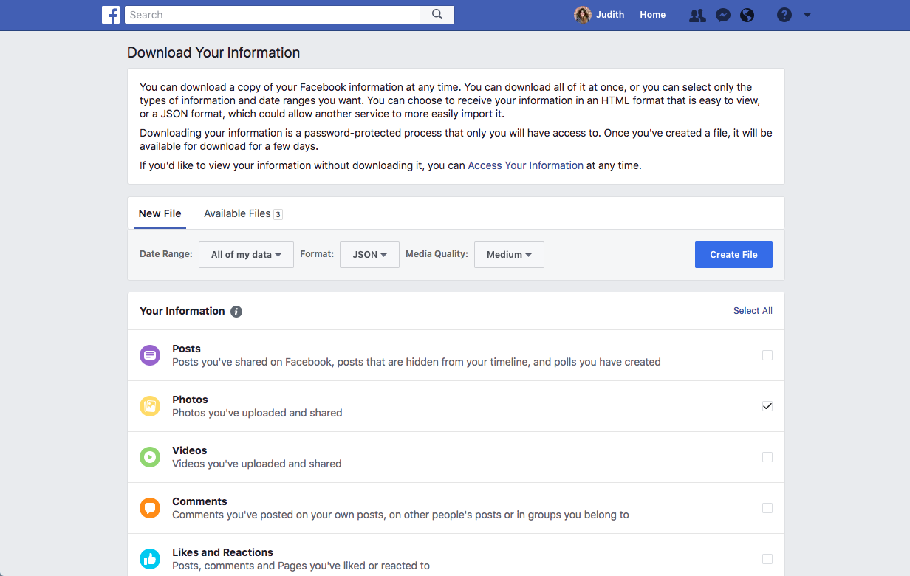
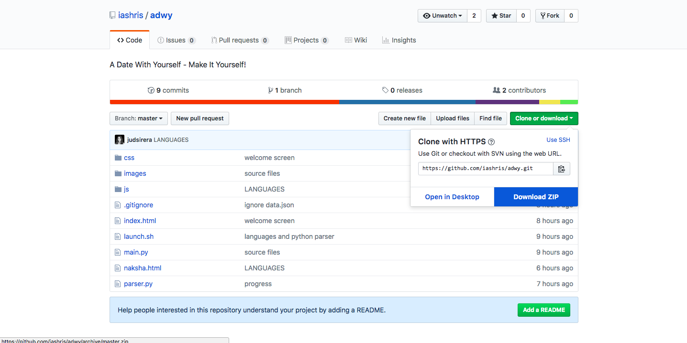
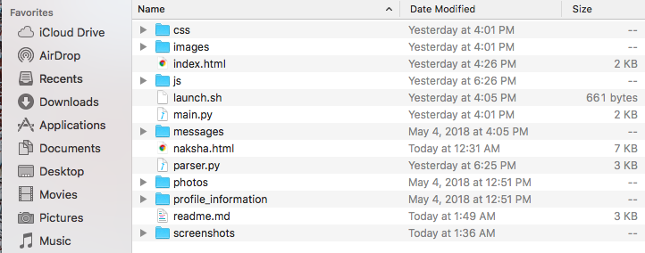
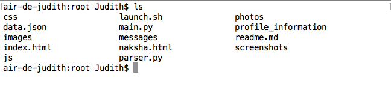
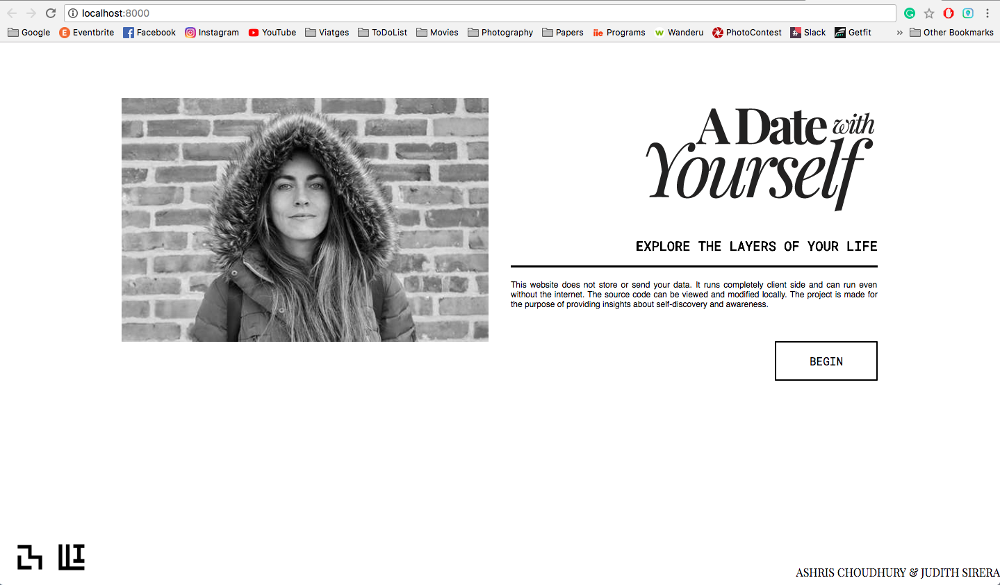

# A Date With Yourself

A Date With Yourself is an interactive experience that lets you ponder the digital footprints you've left  behind over the years on social media and encourages you to reflect on how you've changed as a person.

## Prepare the environment
A Date With Yourself requires the following steps for being executed correctly.

### 1. Create your Facebook data
Go [here](https://www.facebook.com/dyi/?x=AdmMouE4Z71ItRyv&referrer=www_settings) and select the following data to download:
 - [x] Photos
 - [x] Messages
 - [x] Profile Information

It's important you select **All your data** in  **Format: JSON**. As lowest is the quality of the media, the fastest will download.
You will receive a Facebook notification and an email when the data is ready to be download it.



### 2. Download ADWY source code
By clicking on **Clone or Download** and **Download ZIP**


### 3. Add your facebook data into the ADWY folder
Unzip your downloaded file from facebook and add **Photos**, **Messages** and **Profile_information** folders into the A Date With Yourself folder you've just downloaded. The folder should look like the image below.




## Start
The environment is ready. Now is time to execute the website.

### 4. Open your command console from your computer

- Mac: **Terminal**
- Windows: **Cmd**

### 5. Change your directory using cd command
Use the following command to access to the root of the project. Where the index.html is:
```
cd path/to/your/directory
```
 For example:
```
cd Downloads/ADWY/
```
You can check if your in the correct folder by entering the command `ls`then all the files and folders will be displayed




### 6. Run the app
Execute the launch.sh file by using the following command:
```
./launch.sh
```
After a few seconds a chrome tab is gonna open with the address **localhost:8000** and A Date With Yourself will appear. If you are on Windows and cannot run .sh files, directly enter the list of commands mentioned in the launch.sh file into the Command Prompt.

Please Note : You need to have either Python 2 or 3 installed in your machine to run ADWY. Also, if you are on Windows machine and are unable to launch the .sh file, open the file in a text editor and enter the code into the Command Prompt line by line. We have commented the launch.sh file for you to follow.



## Stop the app
Return to the command line app and shutdown the server by pressing
<kbd>CTRL</kbd>+<kbd>C</kbd>

# Data privacy
This website does not store or send your data. It runs completely client side and can run even without the internet. The source code can be viewed and modified locally. The project is made for the purpose of providing insights about self-discovery and awareness.

# About Us
**Ashris Choudhury** - ashris@mit.edu - [iashris.com](http://iashris.com/)

**Judith Sirera** - jsirera@mit.edu - [judithsirera.com](http://judithsirera.com/)